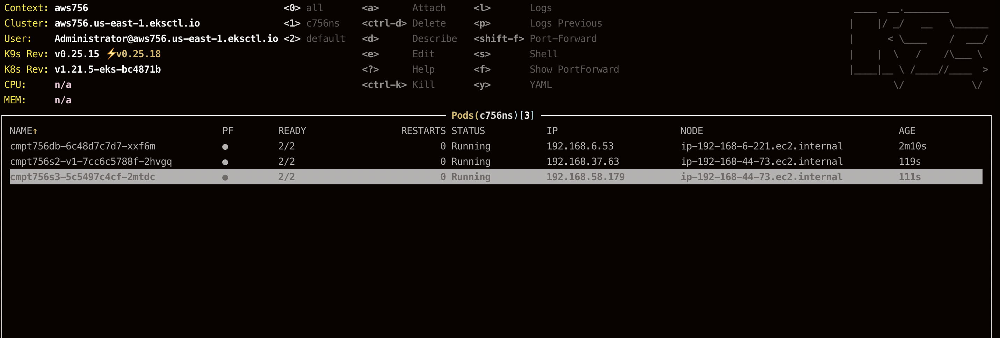
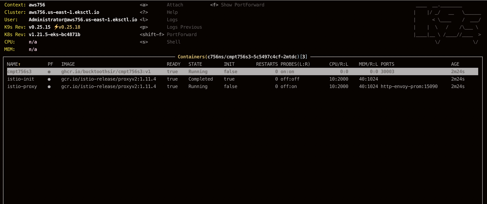
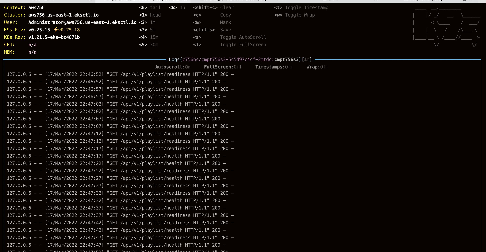

[](https://classroom.github.com/online_ide?assignment_repo_id=7083295&assignment_repo_type=AssignmentRepo)
# tprj
Term Project repo

# Deployment
```bash
git clone https://github.com/scp756-221/term-project-angelababy.git
cd term-project-angelababy
./toos/shell.sh


#update tpl-vars.txt with your own infos
cp cluster/tpl-vars-blank.txt cluster/tpl-vars.txt 
echo $your_github_token > cluster/ghcr.io-token.txt
make -f k8s-tpl.mak templates
make -f allclouds.mak

# these instructions are from assignment 4
make -f eks.mak start
kubectl config use-context aws756
kubectl create ns c756ns
kubectl config set-context aws756 --namespace=c756ns
kubectl config use-context aws756
istioctl install -y --set profile=demo --set hub=gcr.io/istio-release
kubectl label namespace c756ns istio-injection=enabled
kubectl get svc --all-namespaces | cut -c -140


# Build & push the images up to the CR
# check if there's image of s3 in your github package after calling this command
# change the visibility to public
make -f k8s.mak cri
make -f k8s.mak gw db s2 s3

#start k9s to check if the services are deploymented successfully
k9s
```




