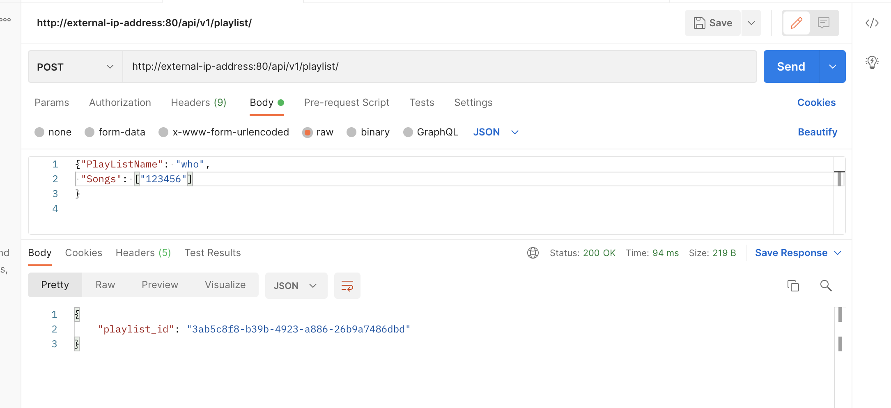

# SFU CMPT 756 project directory of team AngelaBaby

This is the course repo for CMPT 756 (Spring 2022) of team AngelaBaby.


## Directory Structure

This is the directory structure of our project:

~~~
term-project-angelababy
├── allclouds-tpl.mak
├── api-tpl.mak
├── eks-tpl.mak
├── gatling-all.sh
├── gatling-music.sh
├── gatling-playlist.sh
├── gatling-user.sh
├── helm-kube-stack-values.yaml
├── k8s-tpl.mak
├── logs
├── monitoring-lb-services.yaml
├── obs.mak
├── README.md
├── ci
│   ├── clear-ci-images.sh
│   ├── create-local-tables.sh
│   ├── create-local-tables-tpl.sh
│   ├── quick-test.sh
│   ├── runci-local.sh
│   ├── runci.sh
│   ├── tools
│   │   └── README.md
│   └── v1
│       ├── ci_test.py
│       ├── compose-tpl.yaml
│       ├── compose.yaml
│       ├── conftest.py
│       ├── create_tables.py
│       ├── Dockerfile
│       ├── flake-dirs.txt
│       ├── music.py
│       ├── playlist.py
│       ├── requirements.txt
│       ├── test_services.py
│       └── user.py
├── cluster
│   ├── awscred-tpl.yaml
│   ├── awscred.yaml
│   ├── cloudformationdynamodb.json
│   ├── cloudformationdynamodb-tpl.json
│   ├── db-nohealth-tpl.yaml
│   ├── db-nohealth.yaml
│   ├── db-sm.yaml
│   ├── db-tpl.yaml
│   ├── db-vs-delay.yaml
│   ├── db-vs-fault.yaml
│   ├── db-vs.yaml
│   ├── db.yaml
│   ├── dynamodb-service-entry-tpl.yaml
│   ├── dynamodb-service-entry.yaml
│   ├── eks-admin-service-account.yaml
│   ├── grafana-flask-configmap.yaml
│   ├── Kiali-sample-graph.png
│   ├── loader-tpl.yaml
│   ├── loader.yaml
│   ├── monitoring-virtualservice.yaml
│   ├── music-header.yaml
│   ├── playlist-header.yaml
│   ├── s1-nohealth-tpl.yaml
│   ├── s1-nohealth.yaml
│   ├── s1-sm.yaml
│   ├── s1-tpl.yaml
│   ├── s1-vs.yaml
│   ├── s1.yaml
│   ├── s2-dpl-v1-tpl.yaml
│   ├── s2-dpl-v1.yaml
│   ├── s2-dpl-v2-tpl.yaml
│   ├── s2-dpl-v2.yaml
│   ├── s2-dpl.yaml
│   ├── s2-nohealth-tpl.yaml
│   ├── s2-nohealth.yaml
│   ├── s2-sm.yaml
│   ├── s2-svc.yaml
│   ├── s2-vs-canary.yaml
│   ├── s2-vs.yaml
│   ├── s3-sm.yaml
│   ├── s3-tpl.yaml
│   ├── s3-vs.yaml
│   ├── s3.yaml
│   ├── service-gateway.yaml
│   ├── tpl-vars-blank.txt
│   ├── tpl-vars.txt
│   └── users-header.yaml
├── db
│   ├── app.py
│   ├── app-tpl.py
│   ├── Dockerfile
│   ├── LICENSE
│   ├── README.md
│   └── requirements.txt
├── gatling
│   ├── resources
│   │   ├── music.csv
│   │   ├── playlist.csv
│   │   └── users.csv
│   ├── results
│   ├── simulations
│   │   └── proj756
│   │       ├── BasicSimulation.scala
│   │       └── ReadTables.scala
│   └── target
├── loader
│   ├── app.py
│   ├── Dockerfile
│   ├── LICENSE
│   ├── README.md
│   └── requirements.txt
├── monitoring-lb-services.yaml
├── obs.mak
├── README.md
├── mcli
│   ├── Dockerfile
│   ├── Makefile
│   ├── mcli.py
│   └── requirements.txt
├── media
│   ├── ts1.png
│   ├── ts2.png
│   ├── ts3.png
│   └── ts4.png
├── s1
│   ├── app.py
│   ├── Dockerfile
│   ├── LICENSE
│   ├── README.md
│   └── requirements.txt
├── s2
│   ├── app.py
│   ├── Dockerfile
│   └── requirements.txt
├── s3
│   ├── app.py
│   ├── Dockerfile
│   └── requirements.txt
└── tools
    ├── aws-cred.sh
    ├── aws-rotate-cred.sh
    ├── build-configmap.sh
    ├── call-sed.sh
    ├── find-canonical-owner.sh
    ├── findstring.sh
    ├── gatling.sh
    ├── getip.sh
    ├── kill-gatling.sh
    ├── list-dynamodb-tables.sh
    ├── list-gatling.sh
    ├── make.sh
    ├── prep-csil.sh
    ├── process-templates.sh
    ├── profiles.sh
    ├── run-if-cmd-exists.sh
    ├── s2ver.sh
    ├── shell.sh
    ├── waiteq.sh
    └── waitne.sh
~~~

## Prerequisite

~~~
# fill in all the required values in `tpl-vars.txt`.
$ cp cluster/tpl-vars-blank.txt cluster/tpl-vars.txt 
$ echo $your_github_token > cluster/ghcr.io-token.txt
$ make -f k8s-tpl.mak templates
~~~
If you have `~/.aws/config` in your local machine, please make sure the region in this file is the same with the one of `cluster/tpl-vars.txt`.


## Deployment
### 1. Ensure AWS DynamoDB is accessible/running

Regardless of where your cluster will run, it uses AWS DynamoDB
for its backend database. Check that you have the necessary tables
installed by running

~~~
$ make -f k8s.mak ls-tables
~~~

The resulting output should include tables `User`, `Music` and `Playlist`. If it isn't, You can clean the old ones and init new tables.

~~~
$ make -f k8s.mak dynamodb-clean
# wait 30 seconds
$ make -f k8s.mak dynamodb-init
~~~

### 2. Start up an Amazon EKS cluster

~~~
$ make -f eks.mak start
~~~
This is a slow operation, often taking 10–15 minutes

### 3. Create namespace 

~~~
$ kubectl config use-context aws756
$ kubectl create ns c756ns
$ kubectl config set-context aws756 --namespace=c756ns
~~~

### 4. Installing the service mesh istio and tunneling into your cluster in the cloud

To install Istio and label the c756ns namespace:

~~~
$ kubectl config use-context aws756
$ istioctl install -y --set profile=demo --set hub=gcr.io/istio-release
$ kubectl label namespace c756ns istio-injection=enabled
~~~

### 5. Building your images
In this step, you will build four services, db, s1, s2 and s3. 

~~~
$ make -f k8s.mak cri
~~~

There is one manual step left before the system can come up auto-magically: **to switch your container repositories to public access.** 


### 6. Deploying all the services

~~~
$ make -f k8s.mak gw db s1 s2 s3
~~~

### 7. Check the logs of the services
~~~
$ k9s -n c756ns
~~~
If you deploy the services successfully, you'd get a lot of `200` status code for the requests to the services.


### 8. Test your Api

~~~
# get the external ip address
kubectl -n istio-system get service istio-ingressgateway | cut -c -140
~~~
Then your APIs are
```
http://external-ip-address:80/api/v1/user/
http://external-ip-address:80/api/v1/music/
http://external-ip-address:80/api/v1/playlist/
```

Try to send a `create_playlist` to the playlist service by postman. In normal case, you'd get a `200` return status code and a `playlist_id`.




## Gatling

```
# Load test of all three services
./gatling-all.sh <number_of_user>

# Check running Gatling docker
docker container ls

# Check logs of Gatling docker
docker logs <docker_name>
```